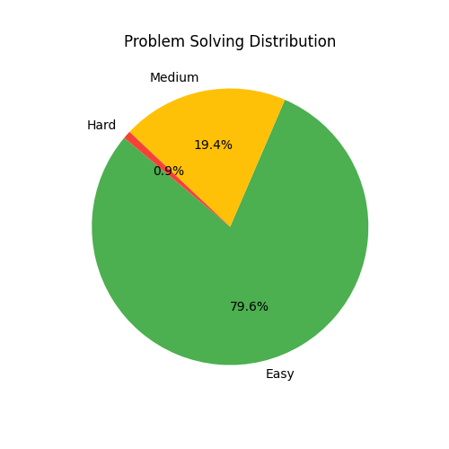

<!-- Here’s a beautifully structured README for your GitHub repository:

---

# 🏆 LeetCode Journey by Sandeep Kumar  
[Visit my LeetCode profile](https://leetcode.com/u/SKSANDY2396/)  

Welcome to my repository, where I document my journey of solving coding challenges on LeetCode. Here, you'll find my solutions, approaches, and reflections on the problems I tackle.  

---

## 🚀 Contest Performance  
- **Contest Rating**: N/A  
- **Global Ranking**: 252105 / N/A  
- **Contests Attended**: 1  
- **Top Rank Achieved**: N/A%  

---

## 💡 Problem-Solving Stats  
- **Acceptance Rate**: 37.39%  
|----------------|---------------------|---------------------|----------------|  
| 🟢 Easy        | 321 / 901          | 37.39%              |
| 🟡 Medium      | 70 / 1920         | 37.39%             |
| 🔴 Hard        | 4 / 870            | 37.39%             |

---

## 🔥 Submission Stats  
- **Total Submissions**: N/A  
- **Attempts**:  
  - 🟢 Easy: 41  
  - 🟡 Medium: 15  
  - 🔴 Hard: 7  

---

## 🏅 Achievements and Badges  
- **Total Badges**: N/A  
- **Most Recent Badge**: N/A  

---

## 📚 About This Repository  
This repository contains solutions to various LeetCode problems in the form of `.ipynb` notebooks and other formats. Each solution is accompanied by explanations and alternative approaches (where applicable).  

---

## 🌟 How to Use This Repository  
1. Browse through the directory to find solutions categorized by problem difficulty.  
2. Refer to the explanations provided alongside each solution to enhance your understanding.  
3. Feel free to contribute or suggest improvements!

---

## 💬 Connect with Me  
For suggestions, discussions, or collaboration:  
📧 Email: sandeep.kumar@science.christuniversity.in  
🔗 LeetCode Profile: [SKSANDY2396](https://leetcode.com/u/SKSANDY2396/)  

---
 -->

# 🏆 LeetCode Journey by Sandeep Kumar  
[Visit my LeetCode profile](https://leetcode.com/u/SKSANDY2396/)  

Welcome to my repository, where I document my journey of solving coding challenges on LeetCode. Here, you'll find my solutions, approaches, and reflections on the problems I tackle.  

---

## 🚀 Contest Performance  
- **Contest Rating**: N/A  
- **Global Ranking**: 252105 / N/A  
- **Contests Attended**: 3  
- **Top Rank Achieved**: N/A%  

---

## 💡 Problem-Solving Stats  
- **Acceptance Rate**: 37.39%  

| Difficulty | Solved / Total | Acceptance Rate |
|------------|----------------|-----------------|
| 🟢 Easy        | 321 / 901          | 37.39%              |
| 🟡 Medium      | 70 / 1920         | 37.39%             |
| 🔴 Hard        | 4 / 870            | 37.39%             |

--

## 🔥 Submission Stats  
- **Total Submissions**: N/A  
- **Attempts**:  
  - 🟢 Easy: 300  
  - 🟡 Medium: 65  
  - 🔴 Hard: 4  

## 📊 Problem Solving Distribution

---

## 🏅 Achievements and Badges  
- **Total Badges**: N/A  
- **Most Recent Badge**: N/A  

---

## 📚 About This Repository  
This repository contains solutions to various LeetCode problems in the form of `.ipynb` notebooks and other formats. Each solution is accompanied by explanations and alternative approaches (where applicable).  

---

## 🌟 How to Use This Repository  
1. Browse through the directory to find solutions categorized by problem difficulty.  
2. Refer to the explanations provided alongside each solution to enhance your understanding.  
3. Feel free to contribute or suggest improvements!

---

## 💬 Connect with Me  
For suggestions, discussions, or collaboration:  
📧 Email: sandeep.kumar@science.christuniversity.in  
🔗 LeetCode Profile: [SKSANDY2396](https://leetcode.com/u/SKSANDY2396/)  

---
## 📄 License

This project is licensed under the MIT License. Feel free to fork, modify, and use it as needed!