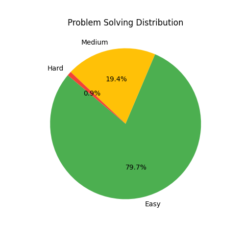

# 🏆 LeetCode Journey by Sandeep Kumar  

 
 
 

[Visit my LeetCode profile](https://leetcode.com/u/SKSANDY2396/)  

Welcome to my repository, where I document my journey of solving coding challenges on LeetCode.  

---

## 🚀 Contest Performance  
- **Contest Rating**: 1383.805  
- **Global Ranking**: 681457 / 769342  
- **Contests Attended**: 3  
- **Top Rank Achieved**: 88.75%  

### 📈 Recent Contests
| Contest | Rating | Rank | Problems Solved |
|---------|--------|------|----------------|
| Weekly Contest 429 (2024-12-22) | 1383.81 | 13344 | 1 |
| Biweekly Contest 146 (2024-12-21) | 1404.03 | 14093 | 1 |
| Biweekly Contest 141 (2024-10-12) | 1414.50 | 24872 | 0 |

### 📊 Contest Leaderboard
| Contest | Rating | Progress |
|---------|--------|---------|
| Biweekly Contest 141 (2024-10-12) | 1414.50 | ███████░░░░░░░░░░░░░ |
| Biweekly Contest 146 (2024-12-21) | 1404.03 | ███████░░░░░░░░░░░░░ |
| Weekly Contest 429 (2024-12-22) | 1383.81 | ██████░░░░░░░░░░░░░░ |

---

## 💡 Problem-Solving Stats  
- **Acceptance Rate**: 84.12%  

| Difficulty | Solved | Submissions |
|------------|--------|-------------|
| 🟢 Easy    | 324 | 381 |
| 🟡 Medium  | 80 | 99 |
| 🔴 Hard    | 4 | 5 |

---

## 📊 Problem Solving Distribution

---

## 📚 About This Repository  
This repository contains solutions to various LeetCode problems in the form of `.ipynb` notebooks and other formats.  

---

## 💬 Connect with Me  
📧 Email: sksandy3869@gmail.com 
🔗 LeetCode Profile: [SKSANDY2396](https://leetcode.com/u/SKSANDY2396/)  

---

## 📄 License  

This project is licensed under the MIT License.
